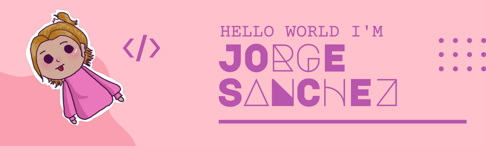

## README.INIT("👋");

<!-- Readme Banner-->

<!-- Social media badges -->

    

<!--Whoami-->

## 👨‍💻 Whoami

<samp>
I'm Jorge Sanchez, I've been passionate about technology since I was a kid, I like to experiment with new technologies whenever I can
 
 
I have about 2 years of professional experience and I have had the opportunity to collaborate with really talented people as well as contribute to large scale projects on some internships
 
 
Don't hesitate to contact me for any kind of matter and I hope you have fun in my profile
 
 

_PS: Don't forget to check out my quote of the day powered by LOTR_
</samp>

<!-- Github Stats-->

## 💪 Github Stats

<!-- Technologies Used-->

## 🧪 Technologies Used

**Languages**

         

**Frameworks**

         

**IDEs/Editors**

       

**Hosting**

   

**Databases**

    

**Operating Systems**

    

**Other**

       

<!-- LOTR Quote-->
## 🧙‍♂️ LOTR QUOTE
<samp>

Deeds will not be less valiant because they are unpraised.

- Aragorn

Check back at the top of the hour for a new quote!

</samp>